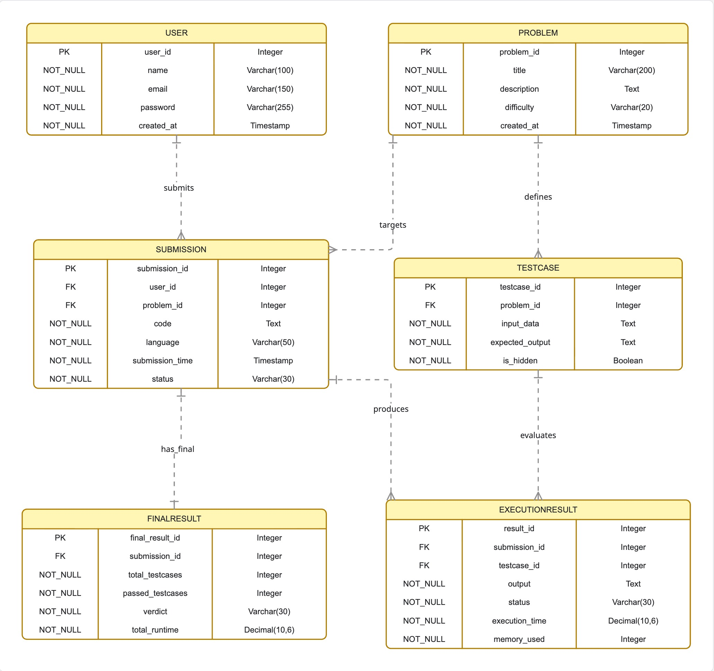
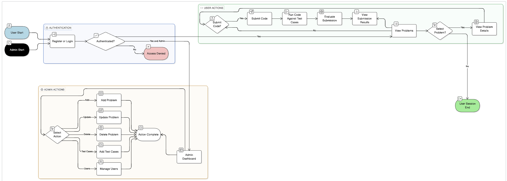
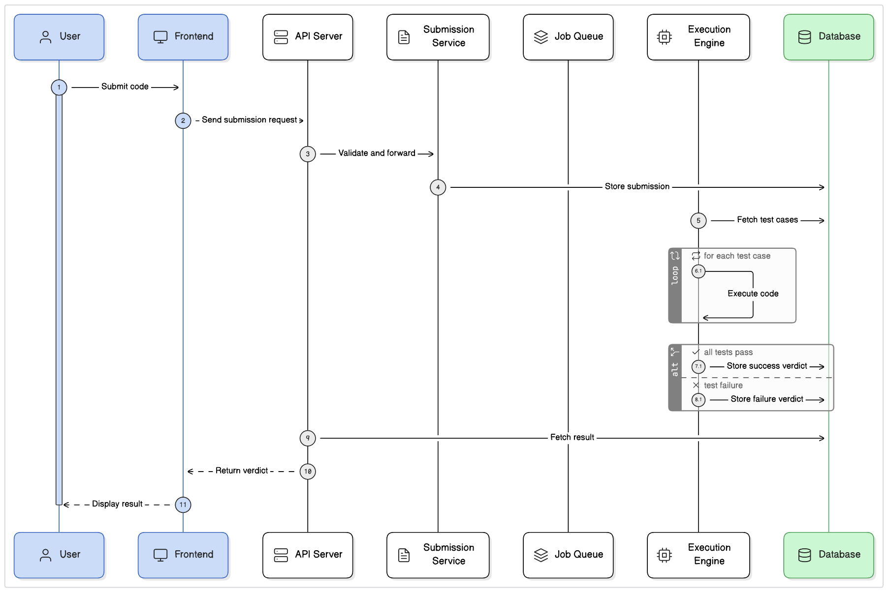

## Submission Service & Job Queue Architecture

### Responsibilities (Hardik Shreyas — Team Leader / System Architect)

- Define the high-level architecture for the **submission → queue → execution → result** pipeline.
- Design and implement the **Submission Service** module.
- Implement a **Job Queue** abstraction to simulate distributed workers.
- Implement a **Singleton ExecutionManager** to coordinate access to the Execution Engine.

### High-Level Flow

1. **Client** sends a submission request (problem ID, language, source code) to the Submission Service.
2. Submission Service:
   - Creates a `SubmissionRecord` with status `QUEUED`.
   - Enqueues a `QueueJob` into the in-memory Job Queue.
3. A **worker** (simulated via `SubmissionService.processQueue()`) pulls jobs from the Job Queue:
   - Marks submission `RUNNING`.
   - Uses `ExecutionManager` (Singleton) to call the core `ExecutionEngine`.
   - Maps `ExecutionResult` into a lightweight `SubmissionResultSummary`.
   - Updates submission status to `COMPLETED` or `FAILED`.
4. Clients can poll `getStatus(id)` and `getResult(id)` from the Submission Service.

### UML Diagram
#### ER Diagram

#### Use Case Diagram

#### Sequential Diagram

### Class & Pattern Mapping

- `SubmissionService`
  - **Role**: Facade/API for submission lifecycle.
  - **Key methods**:
    - `registerProblem(problemId, testCases)` — simple bridge to Problem Management Service.
    - `submit(request: SubmissionRequest): string` — creates `SubmissionRecord`, enqueues job.
    - `processQueue()` — simulates worker processing.
    - `getStatus(id)`, `getResult(id)` — query endpoints.
  - **SOLID**:
    - SRP: Manages submission lifecycle only, not execution.
    - DIP: Depends on `ExecutionManager` and `JobQueue` abstractions.

- `JobQueue`
  - **Pattern**: Simple in-memory queue abstraction.
  - **Future evolution**: Swap implementation with Redis/RabbitMQ without changing `SubmissionService`.
  - **SOLID**:
    - OCP: New queue backends can be added by implementing same interface.

- `ExecutionManager`
  - **Pattern**: **Singleton**.
  - **Role**: Single access point to `ExecutionEngine`; centralizes configuration/cross-cutting concerns.

### Sequence Diagram (Textual)

1. `Client → SubmissionService.submit()`
2. `SubmissionService → JobQueue.enqueue(job)`
3. `Worker (SubmissionService.processQueue)`:
   - `JobQueue.dequeue()`
   - `ExecutionManager.getInstance().execute(code, language, testCases)`
   - `SubmissionService` updates status and result maps.

